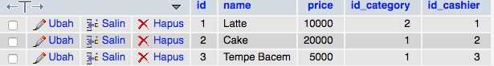
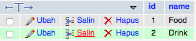
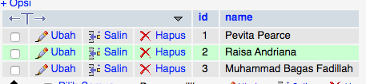
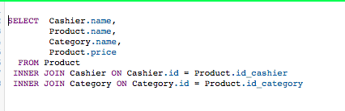
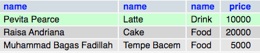

# BootChampTes

Ujian Tes Masuk Bootchamp Arcademy

#1 Json adalah sebuah format standar dalam pengunaan API berisini Key dan Value umumnya semua API melakukan pertukaran data mengunakan format JSON

#6A\
\*Foto Table Product
\
\

\*Foto Table Category
\
\

\*Foto Table Cashier
\
\

\*Foto Table Setelah Di Quary
\
\

\
\

