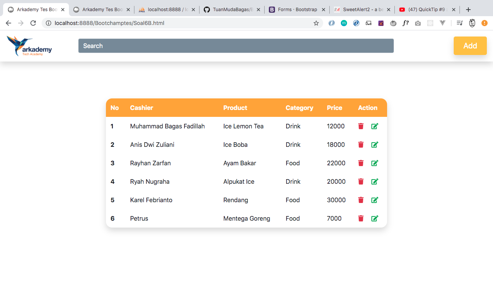
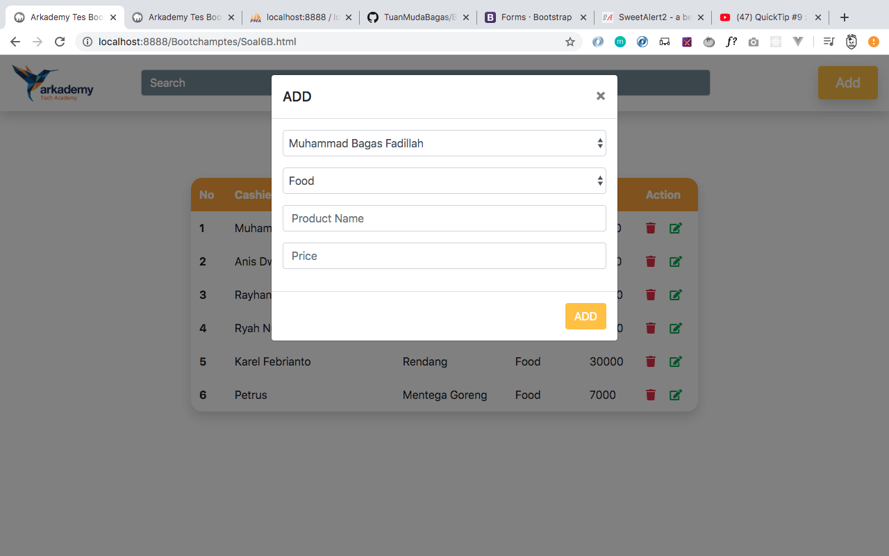
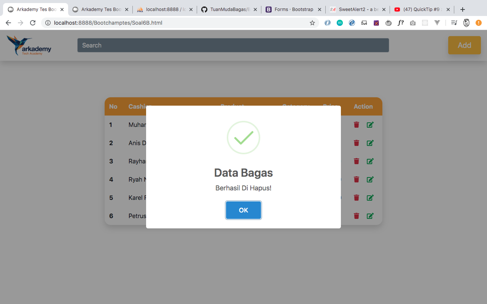

# BootChampTes

Penting!!:Saya Mengunakan Bahasa pemerograman PHP jadi membutuhkan Local Server seperti XAMPP dan untuk SOAL NOMOR 6C saya mengunakan Laravel silahkan seting di env Terlebih dahulu dan Migrate databasenya

Ujian Tes Masuk Bootchamp Arcademy

#1 Json adalah sebuah format standar dalam pengunaan API berisini Key dan Value umumnya semua API melakukan pertukaran data mengunakan format JSON
\
#2 Karena Soal 2 adalah sebuah sistem validasi jadi halaman tidak menampilkan apapun silahkan cek Regex saya
\
#3 Silahkan Buka File Soal3.php dan parameter ke method acaString
\
#4 Silahkan Masukan Sebuah Kalimat dan Huruf Fokal yang akan di gunakan Maka semua huruf vokal pada kalimat akan terganti
\
#5 Silahkan Masukan Nilai kedalam parameter Print Square maka akan otomatis membuat kotak sesuai nilai yang di masukan
\
#6A\
\*Foto Table Product
\
\

\*Foto Table Category
\
\

\*Foto Table Cashier
\
\

\*Foto Table Setelah Di Quary
\
\

\
\

\
\

#6B\
\*Foto Halaman Home
\
\

\
\
\*Foto Halaman ADD
\
\

\
\
\*Foto Halaman Edit
\
\

\
\
\*Foto Halaman Hapus
\
\

\
\

#6C\
\*Saya mengunakan Framework Laravel terdapat dalam folder silahkan seting file env dan migrate databasenya TERIMAKASIH
